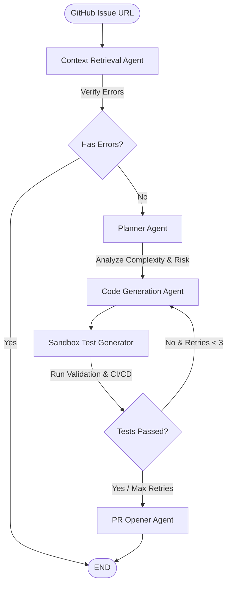

# 🤖 GitFix AI — Autonomous Bug Fixing Pipeline

[](https://fastapi.tiangolo.com/)
[](https://nextjs.org/)
[](https://github.com/langchain-ai/langgraph)
[](https://www.python.org/)
[](https://tailwindcss.com/)

**GitFix AI** is an autonomous agentic pipeline designed to locate, plan, fix, verify, and resolve software bugs on GitHub. Powered by **LangGraph**, **LangChain**, and **LLMs (Groq Llama-3.3)**, GitFix AI bridges the gap between reported GitHub issues and verified Pull Requests. It features a developer-friendly CLI as well as a beautiful, real-time web dashboard that streams agent logs and visual states.

---

## 🗺️ System Architecture & Workflow

GitFix AI employs a multi-agent swarm where each agent handles a dedicated part of the bug resolution cycle. The control flow is orchestrated dynamically using **LangGraph**:



### 🧠 The Agent Swarm

1. **Context Retrieval Agent (`code_reader.py`)**
   - Parses the GitHub issue URL.
   - Enrich context by reading issue discussions/comments and closed historical issues for pattern matching.
   - Leverages LLMs to identify the most relevant files to modify (filtering by code extension and path candidates).
   - Fetches target file contents via PyGithub.
2. **Action Plan Agent (`planner.py`)**
   - Conducts a deep root cause analysis based on the issue description and codebase.
   - Pinpoints exact line numbers of the bug and creates a step-by-step fix strategy, edge case considerations, and risk assessment.
   - Categorizes complexity (`simple` or `complex`) based on risk and file count to direct routing.
3. **Code Generation Agent (`code_writer.py`)**
   - Translates plans into unified diff patches.
   - Validates patch formats and performs multi-language syntax checking (e.g., Python AST + Flake8 linting, Node.js check + TSC syntax checks, HTML/CSS bracket validation).
   - Features self-correction by reviewing its own logic under a simulated LLM code review before writing changes to the state.
4. **Sandbox Test Generator (`test_writer.py`)**
   - Analyzes generated diffs to extract added/removed lines.
   - Writes targeted, mock-supported `pytest` unit tests verifying the fix, ensuring no hardware dependencies break sandbox run environments.
   - Automatically passes failure details and retry feedback to the code generation agent if tests fail.
5. **PR Opener Agent (`pr_opener.py`)**
   - Employs an **atomic commit strategy**: prepares all files and commits them in one execution to a dedicated branch.
   - Verifies commits by reading the remote contents back to verify successful delivery.
   - Commits the generated tests and a customized GitHub Actions CI/CD workflow (`gitfix-validation.yml`) to validate the branch automatically.
   - Creates a rich Pull Request description containing the root cause description, test results, code change diffs, and review checklists.

---

## 🛠️ Tech Stack

- **Backend Logic**: Python 3.11, [LangGraph](https://github.com/langchain-ai/langgraph), [LangChain Core](https://github.com/langchain-ai/langchain), [PyGithub](https://github.com/PyGithub/PyGithub)
- **API & Streaming**: [FastAPI](https://fastapi.tiangolo.com/), Server-Sent Events (SSE) streaming, [Uvicorn](https://www.uvicorn.org/)
- **Model Engine**: [Groq API](https://groq.com/) running `llama-3.3-70b-versatile` (configured for low temperature for precision)
- **Frontend Dashboard**: [Next.js 16](https://nextjs.org/) (App Router), React 19, TypeScript, [Tailwind CSS 4](https://tailwindcss.com/), [Lucide React](https://lucide.dev/)
- **Testing & Verification**: [pytest](https://pytest.org/), GitHub Actions (CI/CD)

---

## 📂 Project Directory Structure

```text
├── agents/                   # Multi-agent swarm implementation
│   ├── code_reader.py        # Issue parser, keyword match, file retriever
│   ├── planner.py            # Deep root cause analyzer & risk planner
│   ├── code_writer.py        # Patch creator, linter, & LLM code reviewer
│   ├── test_writer.py        # Targeted pytest test generator
│   └── pr_opener.py          # Atomic branch committer & pull request generator
├── frontend/                 # Next.js web application
│   ├── src/app/              # Next.js App Router components & styles
│   │   ├── page.tsx          # Real-time SSE streaming web dashboard
│   │   └── globals.css       # Styling & theme variables
│   └── package.json          # Node dependencies and build scripts
├── utils/                    # Helper utilities
│   ├── cost_tracker.py       # Tracks model usage (input/output tokens)
│   └── logger.py             # Configures structured logs
├── tests/                    # Pipeline validation tests (Pytest)
├── api.py                    # FastAPI server exposing endpoints (/fix, /stream_fix)
├── main.py                   # Command Line Interface (CLI) entry point
├── workflow.py               # Orchestration of LangGraph nodes & routing logic
├── state.py                  # Pipeline AgentState representation & type annotations
├── requirements.txt          # Python dependencies
└── pytest.ini                # Pytest configuration
```

---

## 🚀 Installation & Setup

### Prerequisites
1. **GitHub Token**: Create a GitHub Personal Access Token (PAT) with `repo` permissions to access, commit, and create PRs.
2. **Groq API Key**: Obtain a Groq API Key to invoke LLMs.

### 1. Clone & Setup Backend
First, clone this repository:
```bash
git clone https://github.com/Satvik12221as/Github-Agent-System.git
cd Github-Agent-System
```

Create and activate a virtual environment:
```bash
python -m venv venv
# On Windows:
venv\Scripts\activate
# On macOS/Linux:
source venv/bin/activate
```

Install the required packages:
```bash
pip install -r requirements.txt
```

Create a `.env` file in the root directory:
```env
GITHUB_TOKEN=your_github_personal_access_token
GROQ_API_KEY=your_groq_api_key
```

### 2. Setup Frontend Dashboard
Navigate to the frontend directory:
```bash
cd frontend
npm install
```

---

## 💻 Usage

You can run GitFix AI either directly via the CLI or through the web dashboard.

### Option A: Command Line Interface (CLI)
Run the pipeline directly from your terminal:
```bash
python main.py --issue https://github.com/owner/repo/issues/42
```

**CLI Arguments:**
- `--issue`: (Required) The URL of the GitHub issue you want to fix.
- `--verbose`: Shows detailed logs during agent execution.
- `--dry-run`: Executes the agent planning, coding, and test writing steps, but skips opening the real Pull Request.

### Option B: Real-Time Web Dashboard
1. Start the FastAPI backend server (from the root directory):
   ```bash
   uvicorn api:app --reload
   ```
2. Start the Next.js development server (from the `frontend` directory):
   ```bash
   npm run dev
   ```
3. Open `http://localhost:3000` in your browser.
4. Paste the GitHub issue URL and click **Fix Issue**. Watch the agent swarm execution visualizer and logs stream in real-time!

---

## 🧪 Running Unit Tests

To run the unit tests verifying the LangGraph pipeline structure, complexity routers, and agent nodes, run:
```bash
pytest
```
